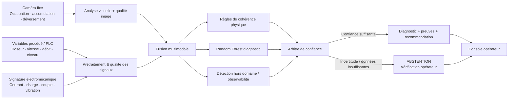

# FLOWTRUST-AFR — Architecture du MVP

## Finalité

FLOWTRUST-AFR est un assistant multimodal de diagnostic de la chaîne d'alimentation en combustibles alternatifs (AFR). Il reste strictement **read-only** : il observe, fusionne les preuves, diagnostique ou s'abstient, puis présente une recommandation à l'opérateur. Il ne commande ni PLC, ni variateur, ni SCADA.

## Couche de données

Le snapshot public exploite 25 caractéristiques représentant quatre familles :

1. **Procédé** : commande doseur, vitesse commandée/réelle, débit massique, niveau de trémie et dérivée de niveau.
2. **Électromécanique** : courant moteur, charge, couple, vibration et variabilité temporelle.
3. **Vision** : proxy de débit, occupation, accumulation, déversement et qualité caméra.
4. **Qualité / confiance** : qualité des signaux vitesse, pesage, niveau, électrique, caméra et disponibilité de la caméra.

## Couche IA

- `afr-rf-diagnostic-v1` : classification des six états connus du banc SIL.
- `afr-isolation-known-domain-v1` : détection de points hors enveloppe connue.
- `afr-physics-rules-v1` : règles déterministes de cohérence physique utilisées comme preuves explicables.
- Vision : baseline caméra fixe et prior visuel à faible autorité ; la vision n'est jamais une source décisionnelle unique.

## Principe de sûreté

Le moteur doit préférer **l'abstention** à un diagnostic forcé lorsque :

- plusieurs sources instrumentales deviennent de qualité insuffisante ;
- la caméra est indisponible et les autres sources ne sont pas assez fiables ;
- plus de 20 % des caractéristiques sont manquantes ;
- le point est hors domaine selon le détecteur OOD ;
- la probabilité du diagnostic reste sous le seuil de confiance.

Toutes les réponses API conservent `automatic_control_allowed=false`.

## Limite de la preuve actuelle

Le classifieur principal est validé sur un banc SIL synthétique et reproductible. Les jeux de données publics réels utilisés dans la version de démonstration fournissent seulement des **preuves auxiliaires de transférabilité hors domaine**. Aucune métrique du MVP ne doit être présentée comme une performance SOCOCIM réelle avant calibration et validation site.
