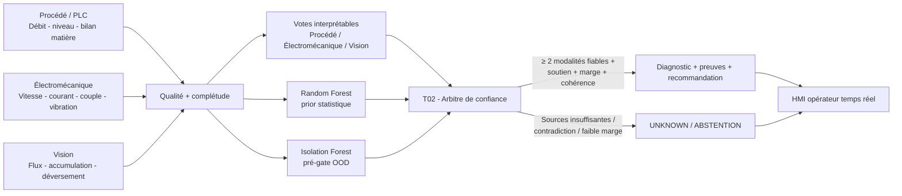

# FLOWTRUST-AFR — Architecture du MVP

## Finalité

FLOWTRUST-AFR est un assistant multimodal de diagnostic de la chaîne d'alimentation en combustibles alternatifs (AFR). Il reste strictement **read-only** : il observe, estime la qualité des sources, fusionne les preuves, diagnostique ou s'abstient, puis présente une recommandation à l'opérateur. Il ne commande ni PLC, ni variateur, ni SCADA.

## Couche de données

Le snapshot public exploite 25 caractéristiques représentant quatre familles :

1. **Procédé** : commande doseur, vitesse commandée/réelle, débit massique, niveau de trémie et dérivée de niveau.
2. **Électromécanique** : courant moteur, charge, couple, vibration et variabilité temporelle.
3. **Vision** : proxy de débit, occupation, accumulation, déversement et qualité caméra.
4. **Qualité / confiance** : qualité des signaux vitesse, pesage, niveau, électrique, caméra et disponibilité de la caméra.

## Couche IA et confiance

- `afr-rf-diagnostic-v1` : classification statistique des six états connus du banc SIL ; dans T02 son vecteur de probabilités est un **prior de soutien**, pas un décideur unique.
- `afr-isolation-known-domain-v1` : pré-gate conservatrice de détection de points hors enveloppe connue.
- `t02-v1` : fusion de confiance entre trois modalités interprétables — procédé, électromécanique et vision — avec pondération par qualité/complétude, contrôle de soutien, contradiction et marge.
- `afr-physics-rules-v1` : règles déterministes utilisées comme éléments de preuve explicables dans la réponse opérateur.
- Vision : baseline caméra fixe et prior visuel à faible autorité ; la vision n'est jamais autorisée à commander le procédé.

Dans le prototype T02, la contribution fusionnée conserve **58 %** de poids aux évidences interprétables et **42 %** au prior Random Forest lorsqu'il est disponible. Ce réglage sert au banc numérique et doit être recalibré sur données industrielles ; il n'est pas présenté comme un optimum SOCOCIM.

## Principe de sûreté T02

Le moteur préfère **l'abstention** à un diagnostic forcé. Les gates sont empilés :

- plus de 20 % de caractéristiques manquantes : abstention avant classification ;
- observabilité instrumentale insuffisante : abstention ;
- point OOD selon l'Isolation Forest : abstention ;
- fiabilité d'une modalité inférieure à `0.35` : modalité exclue ;
- moins de deux modalités indépendantes actives : abstention ;
- soutien insuffisant du candidat par les modalités pertinentes : abstention ;
- contradiction forte entre anomalies portées par des modalités fiables : abstention ;
- contradiction forte entre le prior statistique et les évidences physiques : abstention ;
- désaccord débit/vision important sans mécanisme explicatif cohérent : abstention ;
- confiance fusionnée ou marge entre les deux meilleurs candidats insuffisante : abstention.

Toutes les réponses API conservent `automatic_control_allowed=false`.

## HMI temps réel

Le miroir web du dépôt présente désormais le produit comme une **supervision temps réel simulée**, et non comme une page de résultats scientifiques. La vue principale contient le synoptique AFR, les valeurs évolutives, la vision, les tendances, le diagnostic courant, les fiabilités des modalités et le journal d'événements. Les scénarios de démonstration évoluent progressivement ; le laboratoire de validation reste une vue secondaire.

Le module `app-t02.js` interroge `/api/diagnose` périodiquement. Il n'affiche l'étiquette **T02** que si le backend répond explicitement `fusion.version = t02-v1`. En présence d'un backend v0.2 ou indisponible, l'interface annonce le fallback au lieu de présenter à tort la fusion T02 comme active.

## Limite de la preuve actuelle

Le classifieur principal est validé sur un banc SIL synthétique et reproductible. Les jeux de données publics réels utilisés dans la version de démonstration fournissent seulement des **preuves auxiliaires de transférabilité hors domaine**. Aucune métrique du MVP ne doit être présentée comme une performance SOCOCIM réelle avant calibration et validation site.
