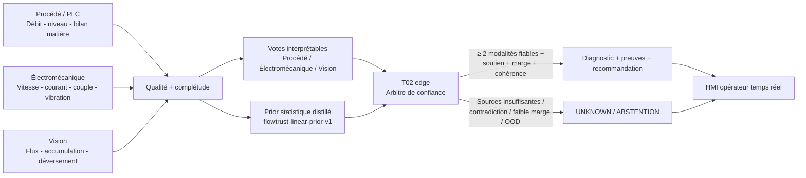

# FLOWTRUST-AFR — Architecture du MVP

## Finalité

FLOWTRUST-AFR est un assistant multimodal de diagnostic de la chaîne d'alimentation en combustibles et matières premières alternatifs (AFR). Il reste strictement **read-only** : il observe, estime la qualité des sources, fusionne les preuves, diagnostique ou s'abstient, puis présente une recommandation à l'opérateur. Il ne commande ni PLC, ni variateur, ni SCADA.

## Couche de données

Le runtime exploite 25 caractéristiques réparties entre quatre familles :

1. **Procédé** : commande doseur, vitesse commandée/réelle, débit massique, niveau de trémie et dérivée de niveau.
2. **Électromécanique** : courant moteur, charge, couple, vibration et variabilité temporelle.
3. **Vision** : proxy de débit, occupation, accumulation, déversement et qualité caméra.
4. **Qualité / confiance** : qualité des signaux vitesse, pesage, niveau, électrique, caméra et disponibilité caméra.

## T02 edge v0.3.1

Le déploiement public utilise `t02-edge-v1` :

- trois modalités interprétables : procédé, électromécanique, vision ;
- fiabilité propre à chaque modalité ;
- exclusion d'une modalité sous `0.35` ;
- au moins deux modalités indépendantes requises ;
- contrôle du soutien, de la marge entre hypothèses et des contradictions ;
- gate hors enveloppe sur les variables cœur ;
- abstention avant inférence si plus de 20 % des caractéristiques sont absentes/non finies.

La fusion donne **78 %** du poids aux évidences multimodales et **22 %** au prior statistique. Le prior ne peut pas contourner les gates de sûreté.

## Prior statistique distillé

`flowtrust-linear-prior-v1` est un classifieur logistique entraîné hors ligne sur le banc SIL, puis exporté sous forme de moyenne, échelle, coefficients et intercepts. Cette distillation permet au runtime public d'exécuter l'inférence sans dépendance ML lourde.

Le fichier versionné est `models/linear_prior_v1.json`. Le runtime de déploiement Node est dans `deploy/vercel/t02_core.js`.

Le Random Forest reste disponible dans le banc R&D comme baseline et source de comparaison ; il n'est plus nécessaire dans la fonction edge publique.

## Principe de sûreté

Le moteur préfère **l'abstention** à un diagnostic forcé :

- > 20 % de valeurs absentes/non finies → abstention ;
- moins de deux modalités fiables → abstention ;
- capteur de pesage fortement suspect → abstention ;
- principales sources simultanément désynchronisées/dégradées → abstention ;
- distance excessive à l'enveloppe SIL sur les variables cœur → abstention ;
- soutien fusionné insuffisant → abstention ;
- marge insuffisante entre les deux hypothèses principales → abstention ;
- défaut insuffisamment soutenu par des modalités indépendantes → abstention ;
- contradiction forte sans prior suffisamment cohérent → abstention.

Toutes les réponses API conservent `automatic_control_allowed=false`.

## HMI temps réel

La vue principale est une supervision opérateur, pas une page de résultats scientifiques. Elle contient : synoptique AFR, valeurs évolutives, tendances, diagnostic T02, fiabilité des sources, explications, suggestions, alarmes, buzzer et journal d'événements.

L'opérateur peut lancer des tests guidés ou injecter des scénarios de démonstration. Les événements évoluent progressivement pour montrer la transition entre état normal, dérive, diagnostic et éventuelle abstention.

`t02-live.js` appelle périodiquement `/api/diagnose` et remplace les diagnostics statiques de démonstration par la décision du backend T02.

## Caméra

L'accès caméra se fait uniquement après autorisation du navigateur. Dans v0.3.1, le traitement local publié mesure la qualité technique de l'image — luminosité, contraste, netteté — et ne prétend pas reconnaître le contenu industriel.

La perception industrielle profonde (scene-gate convoyeur, segmentation/suivi de matière, anomalies visuelles) reste une brique V2 qui sera activée après validation séparée.

## Déploiement

Le runtime Vercel public est volontairement léger : fonctions Node sans dépendance ML lourde, prior distillé versionné, HMI web et API T02. Cette architecture évite les bundles Python volumineux tout en conservant une chaîne de décision traçable.

Le pilote industriel proposé reste local/edge, connecté à OPC UA/historian en lecture seule, avec caméra industrielle et journalisation locale. La calibration finale se fait sur données site.
