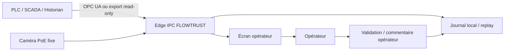

# FLOWTRUST-AFR — Proposition de pilote SOCOCIM

## Objectif

Valider FLOWTRUST-AFR sur **un seul point critique de la chaîne d'alimentation en combustibles alternatifs**, sans modifier la logique de contrôle existante. Le pilote doit d'abord observer et apprendre les distributions réelles du site, puis comparer les diagnostics au jugement des équipes exploitation/maintenance.

## Principe d'intégration

**Aucune écriture vers le PLC, le SCADA ou le variateur n'est requise.**

## Matériel minimal recommandé

### 1. Edge computer / IPC

Un ordinateur industriel local ou un équipement edge équivalent, avec :

- CPU x86-64 récent ou plateforme edge GPU si la vision avancée est activée ;
- 16 Go RAM minimum recommandés ;
- SSD industriel >= 512 Go pour journalisation/replay ;
- deux interfaces Ethernet si segmentation OT/vision nécessaire ;
- alimentation adaptée à l'environnement industriel et, si possible, onduleur local.

Pour le premier pilote, un GPU n'est pas obligatoire si l'on conserve la baseline vision légère. Il devient pertinent pour un futur modèle de segmentation spécialisé.

### 2. Caméra

Une seule caméra fixe suffit pour le premier cas d'usage, après choix du point de transfert. Spécifications cibles :

- caméra IP industrielle PoE ;
- 1080p ou 4 MP ;
- WDR pour variations d'éclairage ;
- boîtier adapté à poussière/chocs, typiquement IP67 et protection mécanique appropriée ;
- objectif choisi selon distance et largeur de bande ;
- montage rigide, hors zone de vibration excessive.

Le choix final de référence, focale et boîtier doit suivre une visite terrain. Acheter la caméra avant cette visite créerait un risque inutile de mauvais champ de vision.

### 3. Positionnement caméra

La caméra doit regarder **la matière et non uniquement la machine**. Les critères sont :

- vue stable sur la bande ou la zone de transfert ;
- visibilité de la zone utile et d'une éventuelle accumulation/déversement ;
- angle limitant les occultations par structures ;
- distance permettant une résolution suffisante de la matière ;
- protection contre encrassement direct ;
- éclairage aussi constant que possible.

Le meilleur emplacement doit être choisi avec exploitation/maintenance après observation du flux réel.

### 4. Variables à récupérer en priorité

Réutiliser d'abord les instruments existants :

- commande doseur ;
- vitesse convoyeur commandée et réelle ;
- débit massique du doseur/pesage ;
- niveau de trémie ;
- courant ou charge moteur ;
- couple si disponible via variateur ;
- vibration si déjà instrumentée ;
- états, alarmes et arrêts pertinents.

**Aucun nouveau capteur n'est obligatoire pour démarrer** si ces variables sont déjà disponibles. Un capteur additionnel ne doit être ajouté qu'après analyse des lacunes d'observabilité.

## Phases du pilote

### Phase A — Survey & mapping

- sélectionner un seul point AFR ;
- inventorier tags PLC/SCADA, fréquence et qualité historique ;
- relever contraintes réseau/cybersécurité ;
- définir le champ caméra ;
- établir les scénarios réellement observés et la nomenclature opérateur.

### Phase B — Replay historique

- exporter plusieurs semaines/mois d'historian si disponible ;
- synchroniser événements, alarmes et interventions ;
- recalibrer distributions et seuils ;
- mesurer couverture et taux d'abstention.

### Phase C — Shadow mode

- acquisition live read-only ;
- diagnostics non affichés ou affichés uniquement à l'équipe projet ;
- comparaison avec événements réels ;
- aucune influence sur l'exploitation.

### Phase D — Mode conseil

Uniquement après validation des critères terrain : affichage opérateur des diagnostics, preuves, niveau de confiance et recommandation de vérification. L'opérateur reste décisionnaire.

## Cybersécurité et OT

- connexion read-only et compte de service dédié ;
- segmentation réseau conforme à l'architecture OT du site ;
- aucun accès cloud requis pour l'inférence industrielle ;
- journalisation locale et contrôle des versions modèles ;
- revue des flux réseau par l'équipe OT avant mise en service.

## Critère de réussite du pilote

Le pilote est réussi si FLOWTRUST-AFR apporte une information exploitable **sans créer de risque opérationnel**, sait s'abstenir en cas de mauvaise observabilité et permet de quantifier sur données réelles le délai de détection, les faux diagnostics, l'accord opérateur et l'impact potentiel sur pertes matière/temps de diagnostic.
